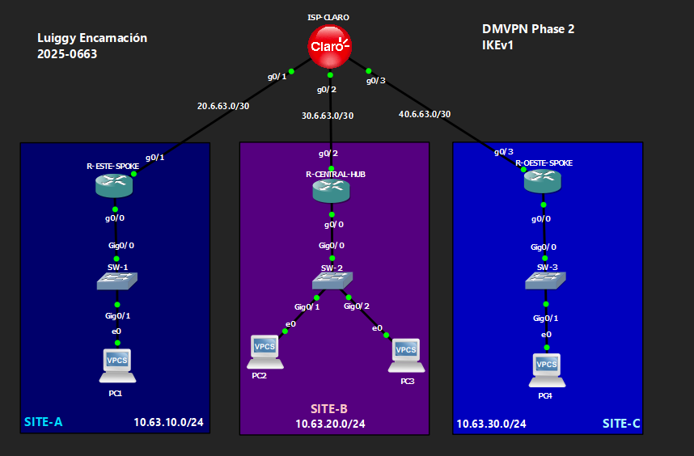

# 🔒 VPN Site-to-Site DMVPN Fase 2 — IKEv1

**Luiggy Habraham Encarnación Cabrera · Matrícula 2025-0663**


> Red hub-and-spoke DMVPN Fase 2 con IKEv1, mGRE multipunto, NHRP y enrutamiento dinámico OSPF.

---

## 📑 Tabla de Contenido

1. [Objetivo del Laboratorio](#-objetivo-del-laboratorio)
2. [Parámetros Usados](#-parámetros-usados)
3. [Documentación de la Red](#️-documentación-de-la-red)
4. [Funcionamiento de la VPN](#-funcionamiento-de-la-vpn)
5. [Configuración](#-configuración)
6. [Verificación](#-verificación)
7. [Capturas de Pantalla](#-capturas-de-pantalla)
8. [Video de Demostración](#-video-de-demostración)

---

## 🎯 Objetivo del Laboratorio

Implementar una red **DMVPN Fase 2** con **IKEv1**, en topología hub-and-spoke con un hub central (R-CENTRAL-HUB) y dos spokes (R-ESTE-SPOKE, R-OESTE-SPOKE), usando una interfaz **mGRE** (`tunnel mode gre multipoint`) protegida por IPSec y **NHRP** para la resolución dinámica de direcciones. El objetivo es entender el modelo Fase 2, donde los spokes **preservan el next-hop original**, pero **sin la señalización NHRP** (`redirect`/`shortcut`) que sí trae la Fase 3 — por lo que el tráfico entre spokes sigue pasando por el hub.

---

## 🧩 Parámetros Usados

| Parámetro | Valor |
|---|---|
| Versión IKE | IKEv1 (ISAKMP) |
| Cifrado Fase 1 | AES 256 |
| Hash Fase 1 | SHA |
| Autenticación | Pre-shared key (`Luiggy20250663!`), aceptada desde cualquier IP (`0.0.0.0 0.0.0.0`) |
| Grupo DH | 14 |
| Transform-set (Fase 2) | esp-aes 256 / esp-sha-hmac |
| Modo IPSec | Transporte |
| Encapsulamiento | mGRE (`tunnel mode gre multipoint`) |
| NHRP | Autenticación `20250663`, network-id `63` |
| Rol NHRP | Hub = NHS; Spokes registrados vía `ip nhrp nhs` |
| Señalización Fase 3 | No presente (sin `redirect`/`shortcut`) |
| Enrutamiento dinámico | OSPF point-to-multipoint sobre Tunnel0 |

---

## 🗺️ Documentación de la Red

### Topología



### Tabla de Direccionamiento

| Dispositivo | Interfaz | IP | Red |
|---|---|---|---|
| ISP-CLARO | g0/1 | 20.6.63.2/30 | Hacia R-ESTE-SPOKE |
| ISP-CLARO | g0/2 | 30.6.63.2/30 | Hacia R-CENTRAL-HUB |
| ISP-CLARO | g0/3 | 40.6.63.2/30 | Hacia R-OESTE-SPOKE |
| ISP-CLARO | Lo0 | 50.50.50.50/32 | Loopback de pruebas |
| R-CENTRAL-HUB | g0/2 (WAN) | 30.6.63.1/30 | Hacia ISP |
| R-CENTRAL-HUB | g0/0 (LAN) | 10.63.20.1/24 | SITE-B |
| R-CENTRAL-HUB | Tunnel0 | 192.168.63.1/24 | mGRE (NHS) |
| R-ESTE-SPOKE | g0/1 (WAN) | 20.6.63.1/30 | Hacia ISP |
| R-ESTE-SPOKE | g0/0 (LAN) | 10.63.10.1/24 | SITE-A |
| R-ESTE-SPOKE | Tunnel0 | 192.168.63.2/24 | mGRE |
| R-OESTE-SPOKE | g0/3 (WAN) | 40.6.63.1/30 | Hacia ISP |
| R-OESTE-SPOKE | g0/0 (LAN) | 10.63.30.1/24 | SITE-C |
| R-OESTE-SPOKE | Tunnel0 | 192.168.63.3/24 | mGRE |

### Detalles del Entorno

| Parámetro | Valor |
|---|---|
| Emulador | GNS3 / Packet Tracer |
| Dispositivos Cisco | IOU / Router IOS |
| VLANs | VLAN 1 (default) en SW-1, SW-2, SW-3 |
| Sitios | SITE-A (10.63.10.0/24), SITE-B (10.63.20.0/24), SITE-C (10.63.30.0/24) |

---

## 🔬 Funcionamiento de la VPN

**Fase 1 (ISAKMP/IKEv1):**
- `crypto isakmp policy 10`: AES-256, SHA, pre-share, grupo DH 14.
- `crypto isakmp key Luiggy20250663! address 0.0.0.0 0.0.0.0`: la clave se acepta desde **cualquier IP** (comodín), ya que el hub debe aceptar conexiones de múltiples spokes sin conocer sus IPs de antemano.

**Fase 2 (IPSec):**
- `crypto ipsec profile DMVPN-PROFILE` en **modo transporte** (el GRE ya encapsula, IPSec solo cifra encima).

**GRE Multipunto + NHRP:**
- `interface Tunnel0` con `tunnel mode gre multipoint`: permite que un solo túnel lógico soporte múltiples peers.
- **Hub:** `ip nhrp map multicast dynamic` (aprende automáticamente quién se registra) y actúa como **NHS (Next Hop Server)**.
- **Spokes:** `ip nhrp map <tunnel-ip-hub> <wan-ip-hub>` y `ip nhrp map multicast <wan-ip-hub>` estáticos, más `ip nhrp nhs 192.168.63.1` para registrarse contra el hub.
- `ip ospf network point-to-multipoint` sobre Tunnel0 permite el enrutamiento dinámico entre las tres LANs.

**Característica distintiva de Fase 2 (vs Fase 3):**
- No hay `ip nhrp redirect` (en el hub) ni `ip nhrp shortcut` (en los spokes). Aunque el next-hop original se preserva en las rutas, **no hay señalización activa** para que los spokes negocien un túnel directo entre ellos — en la práctica el tráfico spoke-to-spoke atraviesa el hub.

---

## 🔧 Configuración

Ver archivo: `Configuración para VPN DMVPN Fase 2 IKEv1.txt`

---

## ✅ Verificación

```
show dmvpn
show ip nhrp
show ip route
show ip ospf neighbor
show crypto isakmp sa
show crypto ipsec sa
```

Se espera:
- `show dmvpn` → estado de las sesiones NHRP entre hub y spokes.
- `show ip ospf neighbor` → adyacencias formadas sobre Tunnel0.
- `show crypto isakmp sa` → SA en **QM_IDLE** por cada spoke conectado.

---

## 📸 Capturas de Pantalla

```
evidencias/
├── 01_topologia.png
├── 02_show_dmvpn.png
├── 03_show_ip_nhrp.png
├── 04_show_ip_ospf_neighbor.png
├── 05_show_ip_route.png
├── 06_show_crypto_isakmp_sa.png
├── 07_show_crypto_ipsec_sa.png
└── 08_wireshark_esp_trafico.png
```

---

## 🎬 Video de Demostración

> 📺 **[Ver demostración en YouTube →](https://youtu.be/nbtdNV7OZ1s)**
